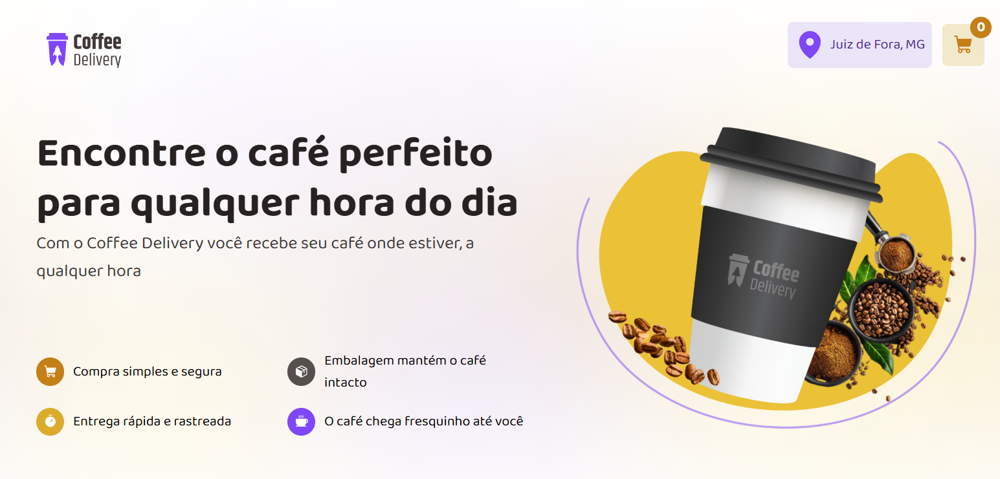

# Coffee Delivery - React + TypeScript + Vite

Simulação de um site de entrega de cafés com gerenciamento completo do carrinho e finalização de pedidos.



## Funcionalidades

- **Seleção de cafés**: Escolha produtos, suas quantidades e gerencie seu carrinho.
- **Carrinho dinâmico**: Atualização em tempo real da quantidade de itens e valor total.
- **Finalização de pedido**: Formulário com validação para endereço e método de pagamento, usando React Hook Form e Zod.
- **Persistência e estado global**: Uso de Context API para gerenciar o estado do carrinho em toda a aplicação.
- **Estilização**: Layout moderno com Styled Components.
- **Tipagem**: Toda a aplicação feita com TypeScript para maior robustez e manutenção.

## Tecnologias Utilizadas

- React
- TypeScript
- Vite
- React Hook Form + Zod (validação de formulários)
- Styled Components
- Context API (para gerenciamento global de estado)

## Como Executar

Se quiser rodar o projeto localmente:

Clone este repositório:
   ```bash
   git clone https://github.com/salesmiguelz/coffee-delivery-react
  ```
Instale as dependências:
  ```bash
  npm install
  ```
Execute o projeto:
```bash
npm run dev
```